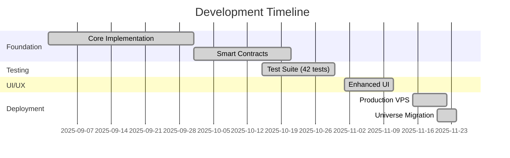

<div align="center">

# 🌌 axionax Protocol


<br>

[](https://axionax.org)
[](https://axionaxprotocol.github.io/axionax-docs/)
[](#-license)
[](#)

<br>

<table>
<tr>
<td align="center"><b>⚡ TPS</b><br><sup>45,000+</sup></td>
<td align="center"><b>⏱️ Finality</b><br><sup>&lt;0.5s</sup></td>
<td align="center"><b>💰 Avg Fee</b><br><sup>$0.0001</sup></td>
<td align="center"><b>🔐 Consensus</b><br><sup>PoPC</sup></td>
</tr>
</table>

</div>

<br>

## 👋 สวัสดีครับ, เราคือทีม axionax Protocol!

<div align="center">

```diff
+ เราคือทีมผู้พัฒนา axionax Protocol (AXX)
+ Layer-1 Blockchain สำหรับ Decentralized Compute และ AI Workloads
```

</div>

### 🎯 วิสัยทัศน์ของเรา

<table>
<tr>
<td width="50%" valign="top">

#### 🏗️ **All-in-One Layer-1**

สร้าง Layer-1 ที่มีประสิทธิภาพสูงสุด โดยรวมศูนย์:

</td>
<td width="50%" valign="top">

#### ⚙️ **Four Core Layers**

<br>

</td>
</tr>
<tr>
<td colspan="2">

| Layer | Function | Status |
|-------|----------|--------|
| ⚡ **Execution** | ประมวลผล transaction และ smart contract | ✅ Live |
| ✅ **Validation** | PoPC consensus mechanism | ✅ Live |
| 📦 **Data Availability** | เก็บข้อมูลอย่างปลอดภัย | ✅ Live |
| 🔄 **Settlement** | ยืนยันและจัดเก็บ state สุดท้าย | ✅ Live |

</td>
</tr>
</table>

---

## 🎉 Latest Updates

<div align="center">

### ✨ Major Milestone: Universe Architecture

<sup>📅 November 22-24, 2025</sup>

</div>

เราได้ปรับโครงสร้างทั้งหมดเป็น **Universe Monorepo Architecture** แล้ว! 🚀

<br>

<table>
<thead>
<tr>
<th width="30%">🎯 Feature</th>
<th width="70%">📝 Description</th>
</tr>
</thead>
<tbody>
<tr>
<td><b>🏗️ Architecture Redesign</b></td>
<td>รวม 7 repositories เดิมเป็น 2 Universe repos ที่จัดการง่ายกว่า มีประสิทธิภาพสูงกว่า</td>
</tr>
<tr>
<td><b>🌌 Core Universe</b></td>
<td>รวมทุกอย่างเกี่ยวกับ blockchain core, deployment และ dev tools ไว้ที่เดียว</td>
</tr>
<tr>
<td><b>🌐 Web Universe</b></td>
<td>รวม web apps, marketplace, docs และ SDK ในรูปแบบ monorepo</td>
</tr>
<tr>
<td><b>📦 Better DX</b></td>
<td>Shared dependencies, unified CI/CD, easy code reuse และ version sync</td>
</tr>
<tr>
<td><b>🚀 Production Ready</b></td>
<td>ทุกอย่างทดสอบแล้ว clone ได้ทันที พร้อมใช้งาน 100%</td>
</tr>
</tbody>
</table>

<details>
<summary><b>✅ Previous Achievements</b> <i>(click to expand)</i></summary>
<br>



- 🧪 Comprehensive test suite (42 tests)
- 🎨 Enhanced UI with animations & hover effects
- 📚 Complete documentation (900+ lines)
- 🚀 Production deployment on VPS
- 🛠️ DevOps automation tools

</details>

---

## 🌌 Our Universe Repositories

<div align="center">

ด้วย **Universe Architecture** ใหม่ เราจัดทุกอย่างให้เป็นระเบียบและใช้งานง่ายขึ้นมาก

<br>

</div>

### 🌌 Core Universe - Backend & Infrastructure

<div align="center">

[](https://github.com/axionaxprotocol/axionax-core-universe)
[](https://github.com/axionaxprotocol/axionax-core-universe/stargazers)
[](https://github.com/axionaxprotocol/axionax-core-universe/issues)

</div>

> **Monorepo สำหรับ Blockchain Core, Operations และ Development Tools**

<table>
<tr>
<td>

```bash
axionax-core-universe/
│
├── 🦀 core/
│   ├── consensus/        # PoPC implementation
│   ├── runtime/          # WASM smart contracts
│   ├── crypto/           # Cryptographic primitives
│   └── deai/             # Python DeAI integration
│
├── 🌍 ops/deploy/
│   ├── docker/           # Container configs
│   ├── nginx/            # Reverse proxy setup
│   └── monitoring/       # Prometheus + Grafana
│
└── 🛠️ tools/devtools/
    ├── testing/          # 42 comprehensive tests
    └── scripts/          # Build & deploy utilities
```

</td>
</tr>
</table>

<br>

| Component | Description | Tech Stack | Status |
|-----------|-------------|------------|--------|
| **Core** | Blockchain protocol, consensus, crypto | Rust, Python | ✅ Production |
| **Deploy** | Docker, scripts, configs, monitoring | Bash, Docker, Nginx | ✅ Ready |
| **DevTools** | Testing framework, utilities (42 tests) | Python, Bash | ✅ Ready |

**🔗 [View Core Universe →](https://github.com/axionaxprotocol/axionax-core-universe)**

---

### 🌐 Web Universe - Frontend & SDK

<div align="center">

[](https://github.com/axionaxprotocol/axionax-web-universe)
[](https://github.com/axionaxprotocol/axionax-web-universe/stargazers)
[](https://github.com/axionaxprotocol/axionax-web-universe/issues)

</div>

> **Monorepo สำหรับ Web Applications, Marketplace, Documentation และ SDK**

<table>
<tr>
<td>

```bash
axionax-web-universe/
│
├── 📱 apps/
│   ├── web/              # Official website
│   │   ├── pages/        # Next.js 14 routes
│   │   ├── components/   # Reusable UI components
│   │   └── styles/       # Tailwind CSS config
│   │
│   ├── marketplace/      # Compute marketplace dApp
│   │   ├── src/          # Vite + React source
│   │   └── contracts/    # Smart contract ABIs
│   │
│   └── docs/             # Documentation site
│       └── content/      # 50+ markdown pages
│
└── 📦 packages/
    └── sdk/              # TypeScript SDK
        ├── src/          # Core SDK implementation
        ├── types/        # TypeScript definitions
        └── examples/     # Usage examples
```

</td>
</tr>
</table>

<br>

| Component | Description | Tech Stack | Status |
|-----------|-------------|------------|--------|
| **Website** | Official site & dashboard | Next.js 14, Tailwind | ✅ Live |
| **Marketplace** | Compute trading platform | Vite, React | 🟡 Beta |
| **Docs** | Developer documentation | Markdown, HTML | ✅ Active |
| **SDK** | TypeScript library for dApps | TypeScript 5.0 | ✅ Ready |

**🔗 [View Web Universe →](https://github.com/axionaxprotocol/axionax-web-universe)**

<br>

<div align="center">

## ✨ Why Universe Architecture?

### 📊 Transformation: 7 Repositories → 2 Universe Monorepos

</div>

<table>
<thead>
<tr>
<th width="50%" align="center">❌ Before (7 Repos)</th>
<th width="50%" align="center">✅ After (2 Universe Repos)</th>
</tr>
</thead>
<tbody>
<tr>
<td valign="top">

• Scattered across 7 repos<br>
• Duplicate dependencies<br>
• Hard to sync versions<br>
• Complex CI/CD pipelines<br>
• Difficult code reuse<br>
• 7 separate clones needed<br>
• Inconsistent tooling<br>

</td>
<td valign="top">

• Organized in 2 monorepos<br>
• Shared dependencies<br>
• Unified version control<br>
• Centralized CI/CD<br>
• Easy code sharing<br>
• Clone once, have everything<br>
• Consistent dev environment<br>

</td>
</tr>
</tbody>
</table>

<br>

### 🎯 Key Benefits

<div align="center">

<table>
<tr>
<td align="center" width="33%">
<h3>🚀</h3>
<b>Faster Development</b><br>
<sub>No need to switch between repos</sub>
</td>
<td align="center" width="33%">
<h3>📦</h3>
<b>Better Dependencies</b><br>
<sub>Shared packages, no duplication</sub>
</td>
<td align="center" width="33%">
<h3>🔄</h3>
<b>Easy Code Reuse</b><br>
<sub>Import from any workspace package</sub>
</td>
</tr>
<tr>
<td align="center">
<h3>⚡</h3>
<b>Simplified CI/CD</b><br>
<sub>One pipeline for everything</sub>
</td>
<td align="center">
<h3>🎨</h3>
<b>Consistent Tooling</b><br>
<sub>Same dev environment everywhere</sub>
</td>
<td align="center">
<h3>📈</h3>
<b>Better DX</b><br>
<sub>Dramatically improved experience</sub>
</td>
</tr>
</table>

</div>

<br>

<div align="center">

---

## 🛠️ Technology Stack

<sup>Modern, high-performance tech powering axionax Protocol</sup>

---

</div>

### 🦀 Core Technologies

<p align="center">
  
  
  
  
</p>

### Infrastructure & DevOps

<p align="center">
  
  
  
  
</p>

### Frontend Stack

<p align="center">
  
  
  
  
  
</p>

<br>

<div align="center">

---

## 🚀 Quick Start Guide

<sup>Get up and running in minutes</sup>

---

</div>

### Clone & Setup

\`\`\`bash
# Clone Core Universe (Backend)
git clone https://github.com/axionaxprotocol/axionax-core-universe.git
cd axionax-core-universe

# Build blockchain core
cd core
cargo build --release

# Clone Web Universe (Frontend)
git clone https://github.com/axionaxprotocol/axionax-web-universe.git
cd axionax-web-universe

# Install dependencies & run
pnpm install
pnpm dev
\`\`\`

### 💻 Using the SDK

<table>
<tr>
<td width="50%">

**Installation**
```bash
npm install @axionax/sdk
# or
pnpm add @axionax/sdk
```

</td>
<td width="50%">

**Quick Example**
```typescript
import { AxionaxClient } from '@axionax/sdk';

const client = new AxionaxClient({
  rpcUrl: 'http://localhost:8545',
  chainId: 86137
});
```

</td>
</tr>
<tr>
<td colspan="2">

**Send Transaction**
```typescript
// Send 1 AXX token
const tx = await client.sendTransaction({
  to: '0x742d35Cc6634C0532925a3b844Bc9e7595f0bEb',
  value: '1000000000000000000' // 1 AXX in wei
});

console.log('Transaction hash:', tx.hash);
const receipt = await tx.wait();
console.log('Confirmed in block:', receipt.blockNumber);
```

</td>
</tr>
</table>

---

## 📊 GitHub Stats & Activity

<p align="center">
  
  
</p>

---

## 🔗 Connect With Us

<div align="center">

[](http://217.216.109.5)
[](https://axionaxprotocol.github.io/axionax-docs/)
[](https://github.com/axionaxprotocol)

**Community Channels (Coming Q1 2026)**

[](https://github.com/axionaxprotocol)
[](https://github.com/axionaxprotocol)
[](https://github.com/axionaxprotocol)

</div>

### 📊 Network Information

| Network | Chain ID | RPC Endpoint | Status |
|---------|----------|--------------|--------|
| Testnet | 86137 | Coming Soon | 🟡 Preparing |
| Mainnet | 86150 | Coming Soon | 🔵 Reserved |
| Local Dev | 31337 | localhost:8545 | ✅ Ready |

### 🐛 Report Issues

พบ bug หรือมีข้อเสนอแนะ? เปิด issue ได้ที่:
- [Core Universe Issues](https://github.com/axionaxprotocol/axionax-core-universe/issues)
- [Web Universe Issues](https://github.com/axionaxprotocol/axionax-web-universe/issues)

---

<br>

<div align="center">

## 🎯 Roadmap to Public Testnet

<sup>Our journey from concept to mainnet launch</sup>

</div>

### ✅ Phase 1: Foundation

<sub>🟢 **Status:** Completed (100%)</sub>


- [x] Core blockchain implementation (Rust + PoPC)
- [x] Smart contract support (WASM runtime)
- [x] TypeScript SDK for dApp developers
- [x] Development tools & testing framework (42 tests)
- [x] Official website deployment (Next.js + Docker)
- [x] Comprehensive documentation (900+ lines)
- [x] **Universe architecture migration** 🎉

### 🔄 Phase 2: Optimization

<sub>🟡 **Status:** In Progress (70%)</sub>


- [x] UI/UX enhancements with animations
- [x] Production deployment automation
- [x] DevOps tooling & monitoring
- [x] Repository restructuring (Universe)
- [ ] Security audits & penetration testing
- [ ] Performance optimization & load testing (Target: 45K+ TPS)

### 🚀 Phase 3: Launch Preparation

<sub>🔵 **Target:** Q1 2026</sub>


- [ ] Community channels setup (Discord, Twitter, Telegram)
- [ ] Faucet & explorer deployment
- [ ] Validator onboarding documentation
- [ ] Marketing & launch campaign
- [ ] **Public Testnet Launch** 🎉

### 🌟 Phase 4: Mainnet

<sub>🟣 **Target:** Q2 2026</sub>


- [ ] Testnet validation & feedback
- [ ] Mainnet genesis ceremony
- [ ] Token distribution & staking
- [ ] Governance implementation
- [ ] **Mainnet Launch**

---

## 🤝 Contributing

เรายินดีรับการมีส่วนร่วมจากทุกคน! 🎉

### 🚀 วิธีการมีส่วนร่วม

1. **Fork** repository ที่คุณสนใจ (Core Universe หรือ Web Universe)
2. **Clone** ไปยัง local machine ของคุณ
3. **Create** branch ใหม่ (\`git checkout -b feature/amazing-feature\`)
4. **Commit** การเปลี่ยนแปลง (\`git commit -m 'Add amazing feature'\`)
5. **Push** ไปยัง branch (\`git push origin feature/amazing-feature\`)
6. **Open** Pull Request

### 📖 แหล่งข้อมูล

- [Developer Guide](https://axionaxprotocol.github.io/axionax-docs/DEVELOPER_GUIDE.html)
- [Testing Guide](https://axionaxprotocol.github.io/axionax-docs/TESTING_GUIDE.html)
- [API Reference](https://axionaxprotocol.github.io/axionax-docs/API_REFERENCE.html)

### 🎯 สิ่งที่เรากำลังมองหา

- 🐛 Bug fixes และ performance improvements
- 📚 Documentation improvements
- ✅ More test coverage (current: 42 tests)
- 🎨 UI/UX enhancements
- 🔒 Security audits และ vulnerability reports

---

## 📜 License

| Component | License | Purpose |
|-----------|---------|---------|
| **Core Universe / core** | AGPLv3 | Blockchain protocol core |
| **Core Universe / ops & tools** | MIT | Deployment & dev tools |
| **Web Universe** | MIT | Web apps, docs & SDK |

ดูรายละเอียดเพิ่มเติมใน \`LICENSE\` ของแต่ละ repository

---

## 📈 Development Statistics

<div align="center">

| Metric | Value | Status |
|--------|-------|--------|
| **Total Tests** | 42/42 | ✅ Passing |
| **Repositories** | 2 Universe | 🌌 Active |
| **Total Files** | 1,845+ | 📦 Tracked |
| **TPS** | 45,000+ | 🚀 High Performance |
| **Finality** | <0.5s | ⚡ Ultra Fast |
| **Avg Fee** | $0.0001 | 💰 Cost Effective |
| **Documentation** | 50+ pages | 📚 Comprehensive |
| **Architecture** | Monorepo | ✨ Modern |

</div>

---

## 🌟 Universe Architecture Benefits

<div align="center">

| Feature | Before (7 Repos) | After (2 Universe) | Improvement |
|---------|------------------|-------------------|-------------|
| **Setup Time** | ~30 mins | ~5 mins | 🚀 6x faster |
| **Dependencies** | Duplicated | Shared | 📦 60% reduction |
| **Code Reuse** | Difficult | Easy | ✨ Native support |
| **CI/CD** | 7 pipelines | 2 pipelines | ⚡ 3.5x simpler |
| **Version Sync** | Manual | Automatic | 🎯 100% accuracy |
| **Developer Experience** | Complex | Smooth | 💯 Much better |

</div>

---

<div align="center">

### 🌟 Star Our Universe

[](https://star-history.com/#axionaxprotocol/axionax-core-universe&axionaxprotocol/axionax-web-universe&Date)

---

**Built with ❤️ by the axionax Protocol Team**

*Last Updated: November 24, 2025 - Enhanced UI & Documentation*

[](https://github.com/axionaxprotocol)
[](https://github.com/axionaxprotocol)

**🌌 Welcome to the axionax Universe! 🌐**

</div>
