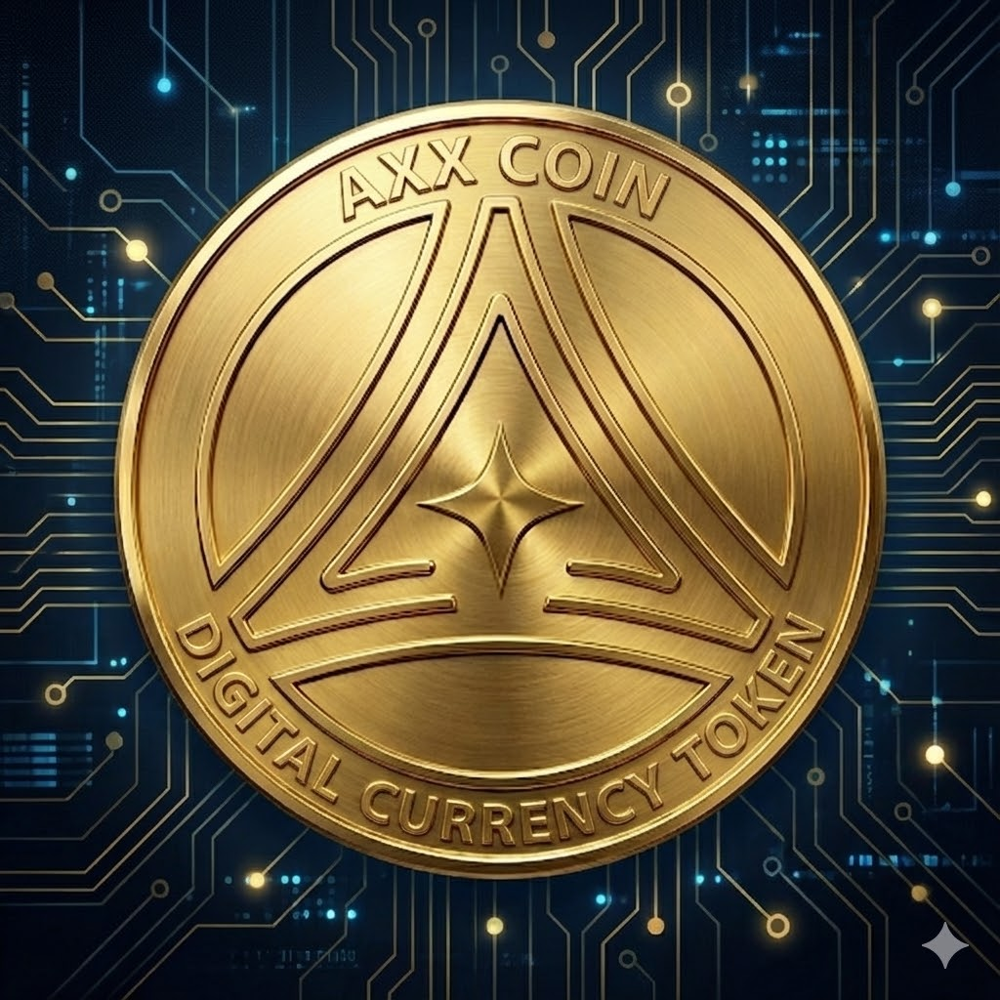

<div align="center">


&nbsp;&nbsp;&nbsp;&nbsp;


# 🌌 axionax Protocol


[](https://axionax.org)
[](#-license)
[](#)

**High-Performance Layer-1 Blockchain for Decentralized Computing & AI Workloads**

```diff
+ ⚡ 45,000+ TPS  |  ⏱️ <0.5s Finality  |  💰 $0.0001 Avg Fee  |  🔐 PoPC Consensus
```

</div>

---

## 📖 Table of Contents
- [Overview](#-overview)
- [Key Features](#-key-features)
- [The axionax Universe](#-the-axionax-universe)
- [Quick Start](#-quick-start)
- [Network Information](#-network-information)
- [Roadmap](#-roadmap)
- [Contributing](#-contributing)
- [License](#-license)

---

## 🎯 Overview

**axionax Protocol (AXX)** is a next-generation Layer-1 blockchain meticulously engineered to support high-performance decentralized computing and intensive AI workloads. It integrates the core components of modern blockchain infrastructure into a single, cohesive platform, eliminating the need for external modular services.

By combining **Execution, Validation, Data Availability, and Settlement** into an "All-in-One" architecture, axionax delivers unprecedented speed, robust security, and seamless developer experience.

---

## ✨ Key Features

| Feature | Description |
| :--- | :--- |
| ⚡ **Extreme Throughput** | Processes **45,000+ TPS** with sub-second (**<0.5s**) finality, suitable for real-time AI and high-frequency trading. |
| 🔐 **PoPC Consensus** | Innovative **Proof of Probabilistic Checking (PoPC)** ensures decentralized and highly efficient block validation. |
| 📦 **Built-in Data Availability** | Secure and scalable internal DA layer, removing reliance on external DA networks. |
| 🧠 **AI & Compute Ready** | Native capabilities designed specifically for decentralized AI training, inference, and complex computational tasks. |

---

## 🌌 The axionax Universe

Our ecosystem is structured using a **Universe Monorepo Architecture**, optimized for performance, scalability, and developer experience.

### 1. Core Universe (Backend & Infrastructure)
The foundation of the axionax Protocol, containing the blockchain node, consensus engine, and deployment orchestration.

[](https://github.com/axionaxprotocol/axionax-core-universe)
[](https://github.com/axionaxprotocol/axionax-core-universe/stargazers)

- **Tech Stack:** Rust, Python, Docker, Bash
- **Components:** Blockchain Core, PoPC Consensus, WASM Runtime, DevOps Pipelines, Testing Framework.
- **🔗 [Explore Core Universe →](https://github.com/axionaxprotocol/axionax-core-universe)**

### 2. Web Universe (Frontend & SDK)
The user and developer interfaces for the axionax Protocol, including dApps, official documentation, and integration SDKs.

[](https://github.com/axionaxprotocol/axionax-web-universe)
[](https://github.com/axionaxprotocol/axionax-web-universe/stargazers)

- **Tech Stack:** Next.js 14, React, TypeScript, Tailwind CSS, pnpm
- **Components:** Web Portals, Marketplace dApp, TypeScript SDK (`@axionax/sdk`), Protocol Documentation.
- **🔗 [Explore Web Universe →](https://github.com/axionaxprotocol/axionax-web-universe)**

---

## 🚀 Quick Start

### For Node Operators & Core Developers

```bash
# Clone the Core Universe repository
git clone https://github.com/axionaxprotocol/axionax-core-universe.git
cd axionax-core-universe/core

# Build the node (requires Rust toolchain)
cargo build --release
```

### For dApp & Web Developers

```bash
# Clone the Web Universe repository
git clone https://github.com/axionaxprotocol/axionax-web-universe.git
cd axionax-web-universe

# Install dependencies and start the development server
pnpm install
pnpm dev
```

### SDK Integration

```bash
npm install @axionax/sdk
```

```typescript
import { AxionaxClient } from '@axionax/sdk';

const client = new AxionaxClient({
  rpcUrl: 'http://localhost:8545',
  chainId: 86137
});

// Send a simple transaction
const tx = await client.sendTransaction({
  to: '0x742d35Cc6634C0532925a3b844Bc9e7595f0bEb',
  value: '1000000000000000000' // 1 AXX
});

console.log('Transaction hash:', tx.hash);
```

---

## 🔗 Network Information

| Network | Chain ID | RPC Endpoint | Status |
| :--- | :---: | :--- | :---: |
| **Local Dev** | `31337` | `http://localhost:8545` | ✅ Ready |
| **Testnet** | `86137` | See [Core Universe README](https://github.com/axionaxprotocol/axionax-core-universe#current-network-testnet) for live RPC endpoints | 🟡 Pre-Testnet |
| **Mainnet** | `86150` | *Coming Soon* | 🔵 Reserved |

---

## 🗺️ Roadmap

| Phase | Key Deliverables | Status |
| :--- | :--- | :---: |
| **Phase 1: Foundation** | Core blockchain (Rust + PoPC), Smart contracts (WASM), TypeScript SDK, Universe architecture | ✅ **100%** |
| **Phase 2: Optimization** | UI/UX enhancements, Production deployment, DevOps automation, Security audits, 45K+ TPS testing | 🔄 **70%** |
| **Phase 3: Launch Prep** | Community channels, Faucet & Explorer, Validator documentation, Public Testnet Launch | 📅 **Q1 2026** |
| **Phase 4: Mainnet** | Testnet validation, Genesis ceremony, Token distribution, Mainnet Launch | 🎯 **Q2 2026** |

---

## 📊 Project Statistics

<div align="center">

[](https://github.com/axionaxprotocol)

</div>

---

## 🤝 Contributing

We welcome contributions from everyone! Whether it's reporting bugs, improving documentation, or contributing code, your help is appreciated.

1. Fork the respective repository ([Core](https://github.com/axionaxprotocol/axionax-core-universe) or [Web](https://github.com/axionaxprotocol/axionax-web-universe)).
2. Create your feature branch (`git checkout -b feature/amazing-feature`).
3. Commit your changes (`git commit -m 'feat: add amazing feature'`).
4. Push to the branch (`git push origin feature/amazing-feature`).
5. Open a Pull Request.

For detailed guidelines, please refer to the [documentation on our main website](https://axionax.org).

---

## 📋 License

The axionax Protocol uses different licenses per component. See each repository for exact terms:

- **Core Universe:** `core/` → AGPLv3; `ops/` and `tools/` → MIT. See [Core Universe → License](https://github.com/axionaxprotocol/axionax-core-universe#license).
- **Web Universe:** MIT. See [Web Universe LICENSE](https://github.com/axionaxprotocol/axionax-web-universe/blob/main/LICENSE).

---

## 📞 Connect & Support

<div align="center">

[](https://axionax.org)
[](https://axionax.org)
[](https://github.com/axionaxprotocol/axionax-core-universe)
[](https://github.com/axionaxprotocol/axionax-web-universe)

**Community Channels** *(Launching Q1 2026)*

[](https://github.com/axionaxprotocol)
[](https://github.com/axionaxprotocol)
[](https://github.com/axionaxprotocol)

</div>

<br>

<div align="center">

**Built with ❤️ by the axionax Protocol Team**  
*Last Updated: February 20, 2026*


</div>